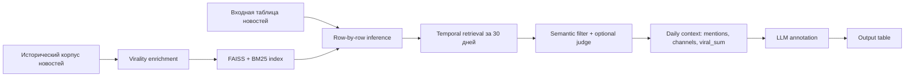

# End-to-End Temporal RAG Inference Pipeline

## Цель

Pipeline принимает таблицу новостей, для каждой новости восстанавливает временной контекст обсуждения за предыдущее окно времени, оценивает виральность связанных сообщений и передает новость вместе с контекстом в LLM для финальной разметки экономического нарратива.

Итог: таблица с исходными новостями, Temporal RAG контекстом, LLM-ответом и структурированными полями разметки.

## Общая Схема



## Этап 1. Подготовка Исторического Корпуса

Вход: историческая база Telegram/news-постов.

Минимальные поля:

| Поле | Назначение |
|---|---|
| `message_id` | идентификатор новости |
| `message` | текст новости |
| `date` / `date_day` | дата публикации |
| `channel_name` | источник |

Корпус нормализуется:

- текст приводится к строке;
- дата приводится к UTC day;
- пустые тексты и невалидные даты удаляются;
- создается единая структура для retrieval.

## Этап 2. Расчет И Приклейка `viral_final`

На этапе построения индекса pipeline добавляет `viral_final` к историческому корпусу.

Источник по умолчанию:

```text
temporal_retrieve_virality_signals/data/dataset_tg_economic.parquet
```

Логика:

1. Если в source-таблице уже есть `viral_final`, он используется напрямую.
2. Если включен `--recompute-virality`, `viral_final` пересчитывается из engagement-метрик.
3. Склейка идет по `message_id`.
4. Если id не совпадают, используется fallback: точное совпадение нормализованного текста `message`.

Формула пересчета:

```text
viral_final =
  0.45 * viral_static
  + 0.20 * viral_dynamic
  + 0.35 * percentile(IsolationForest anomaly score)
```

`viral_static` отражает относительный уровень просмотров, форвардов, реакций и CTR внутри канала.

`viral_dynamic` отражает раннюю динамику распространения: acceleration, decay, peakiness и раннюю долю просмотров.

ML-компонента через `IsolationForest` выделяет аномально сильные посты относительно похожих постов.

## Этап 3. Построение Retrieval Индекса

После добавления `viral_final` строятся два индекса:

| Компонент | Назначение |
|---|---|
| FAISS dense index | семантический поиск по embedding-модели |
| BM25 | лексический поиск по русской токенизации |

Dense retrieval использует E5-style префиксы:

```text
passage: <текст документа>
query: <текст входной новости>
```

Артефакты индекса сохраняются локально в:

```text
end_to_end_inference/indexes/
```

Индекс не коммитится в git, потому что он тяжелый и зависит от локальной машины.

## Этап 4. Входная Таблица Для Inference

На вход подается таблица новых или размечаемых новостей.

Минимальные поля:

| Поле | Назначение |
|---|---|
| `message` | текст новости |
| `date` | опорная дата публикации |
| `topic` | тема, опционально |

Имена колонок можно переопределить через CLI:

```bash
--text-col
--date-col
--topic-col
```

## Этап 5. Temporal Retrieval Для Каждой Новости

Для каждой строки входной таблицы:

1. Берется текст новости как query.
2. Берется дата новости как `anchor_date`.
3. В историческом корпусе ищутся документы:
   - не позже `anchor_date`;
   - внутри окна `--max-window-days`, по умолчанию 30 дней.
4. Запускается hybrid retrieval:
   - dense FAISS;
   - BM25;
   - RRF fusion.

Фильтр кандидатов:

```text
dense_score >= tau_sem_hi
OR
(dense_score >= tau_sem_lo AND bm25_score >= tau_bm25_lo)
```

Так сохраняются документы, которые либо очень близки семантически, либо умеренно близки семантически и подтверждаются лексическим совпадением.

## Этап 6. Optional Judge

Опционально можно включить LLM judge.

Judge получает:

- исходную новость;
- candidate-документ;
- дату и канал candidate-документа.

Он возвращает:

```json
{"relevance": 0}
```

Шкала:

| Значение | Смысл |
|---:|---|
| 2 | тот же инфоповод |
| 1 | тематически связано |
| 0 | нерелевантно |

По умолчанию judge выключен, чтобы pipeline запускался на обычном ПК без тяжелого локального LLM.

## Этап 7. Сбор Temporal Context

Из отфильтрованных кандидатов строится компактный контекст.

Контекст включает:

- опорную дату;
- исходный текст новости;
- размер временного окна;
- количество найденных кандидатов;
- дневную динамику обсуждения;
- число каналов в каждый день;
- число упоминаний;
- `viral_sum` по дням;
- IQR-выбросы по суммарной виральности;
- примеры самых релевантных найденных сообщений.

Пример смысловой структуры:

```text
Опорная дата: 2025-07-01.
Запрос: <текст новости>
Окно: 30 дней.

Выделяющиеся даты по суммарной виральности: ...

Дневная динамика:
Дата: 2025-06-20. Писали 4 канала. Упоминаний: 7. Суммарный виральный скор: 2.31.

Примеры самых релевантных найденных сообщений:
1. 2025-06-20; канал: ...; judge_relevance=1; viral_final=0.73; текст: ...
```

## Этап 8. Финальная LLM-Разметка

LLM получает:

1. текст новости;
2. topic;
3. Temporal RAG контекст;
4. рубрику разметки экономического нарратива.

Модель возвращает строгий JSON:

```json
{
  "economic_effect": -2,
  "information_resonance": 1,
  "topic_agreement": 1,
  "economic_narrative": "Да",
  "narrative_strength": 1,
  "comment": "..."
}
```

Поля валидируются:

| Поле | Диапазон |
|---|---|
| `economic_effect` | -2..2 |
| `information_resonance` | 1..3 |
| `topic_agreement` | 1..3 |
| `economic_narrative` | `Да` / `Нет` |
| `narrative_strength` | 1..3 |
| `comment` | строка |

## Этап 9. Выходной Файл

Pipeline сохраняет таблицу в CSV/XLSX/Parquet/JSONL.

К исходным колонкам добавляются:

| Колонка | Смысл |
|---|---|
| `llm_context` | сгенерированный Temporal RAG контекст |
| `retrieved_candidates_n` | число кандидатов после semantic filter |
| `kept_candidates_n` | число кандидатов после judge или без judge |
| `llm_raw_response` | сырой ответ LLM |
| `economic_effect` | оценка эффекта |
| `information_resonance` | информационный резонанс |
| `topic_agreement` | согласованность темы |
| `economic_narrative` | итоговое решение |
| `narrative_strength` | сила нарратива |
| `comment` | краткое объяснение |
| `inference_error` | ошибка по строке, если была |

## Команды Запуска

Построить индекс:

```bash
python -m end_to_end_inference build-index \
  --corpus temporal_retrieve_virality_signals/data/cleaned_news.csv \
  --virality-source temporal_retrieve_virality_signals/data/dataset_tg_economic.parquet \
  --index-dir end_to_end_inference/indexes/e5_large \
  --encoder-name intfloat/multilingual-e5-large \
  --device cpu
```

Пересчитать `viral_final` при построении индекса:

```bash
python -m end_to_end_inference build-index \
  --corpus temporal_retrieve_virality_signals/data/cleaned_news.csv \
  --virality-source temporal_retrieve_virality_signals/data/dataset_tg_economic.parquet \
  --recompute-virality \
  --index-dir end_to_end_inference/indexes/e5_large
```

Получить только контексты:

```bash
python -m end_to_end_inference infer \
  --input path/to/news.csv \
  --output end_to_end_inference/outputs/news_with_context.csv \
  --index-dir end_to_end_inference/indexes/e5_large \
  --context-only
```

Получить контексты и финальную LLM-разметку:

```bash
python -m end_to_end_inference infer \
  --input path/to/news.xlsx \
  --output end_to_end_inference/outputs/news_inference.xlsx \
  --index-dir end_to_end_inference/indexes/e5_large \
  --model qwen3-vl:235b-instruct-cloud \
  --ollama-host https://ollama.com \
  --continue-on-error
```

## Ключевая Идея

Pipeline отделяет три задачи:

1. **retrieval** отвечает за фактический временной контекст;
2. **virality** отвечает за силу распространения найденных сигналов;
3. **LLM annotation** отвечает за интерпретацию новости с учетом контекста.

Так модель принимает решение не только по одному тексту новости, а с учетом того, как похожие инфоповоды распространялись в предыдущие 30 дней.

